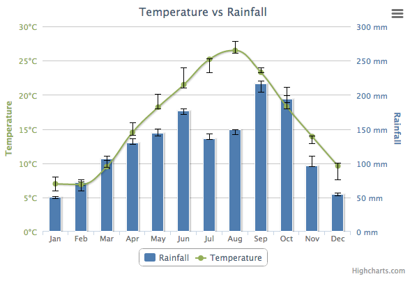

Error bar series
================

Error bars are a graphical representation of the variability of data and are used on graphs to indicate the error, or uncertainty in a reported measurement. 

### Setting up the error bar series

In Highcharts, an error bar series is defined by setting the type to `errorbar`. An error bar series relates to a parent series through the option [linkedTo](http://api.highcharts.com/highcharts/plotOptions.errorbar.linkedTo). By default, the linkedTo option is ":previous", which means that the error bar series by default relates to the series defined before it in the source code. To use another series, the `linkedTo` option relates to the `id` option of the parent series.

    
    series: [{
        name: 'Rainfall',
        color: '#4572A7',
        type: 'column',
        data: [49.9, 71.5, 106.4, 129.2, 144.0, 176.0, 135.6, 148.5, 216.4, 194.1, 95.6, 54.4\]
    }, { 
        name: 'Rainfall error',
        type: 'errorbar',
        data: [[48, 51\], [68, 73\], [92, 110\], [128, 136\], [140, 150\], [171, 179\], [135, 143\], [142, 149\], [204, 220\], [189, 199\], [95, 110\], [52, 56\]\]
    }\]

### Styling the error bars

The different parts of the error bar anatomy can be styled individually. In a non-inverted chart, the _stem_ is the vertical bar in the center, while the _whiskers_ are the top and bottom lines marking the values. The [lineWidth](http://api.highcharts.com/highcharts/plotOptions.errorbar.lineWidth) option sets the line thickness globally. The [whiskerWidth](http://api.highcharts.com/highcharts/plotOptions.errorbar.whiskerWidth) and [stemWidth](http://api.highcharts.com/highcharts/plotOptions.errorbar.stemWidth) options sets the width of the whiskers and the stem individually. For the full set of options, see [plotOptions.errorbar](http://api.highcharts.com/highcharts/plotOptions.errorbar).